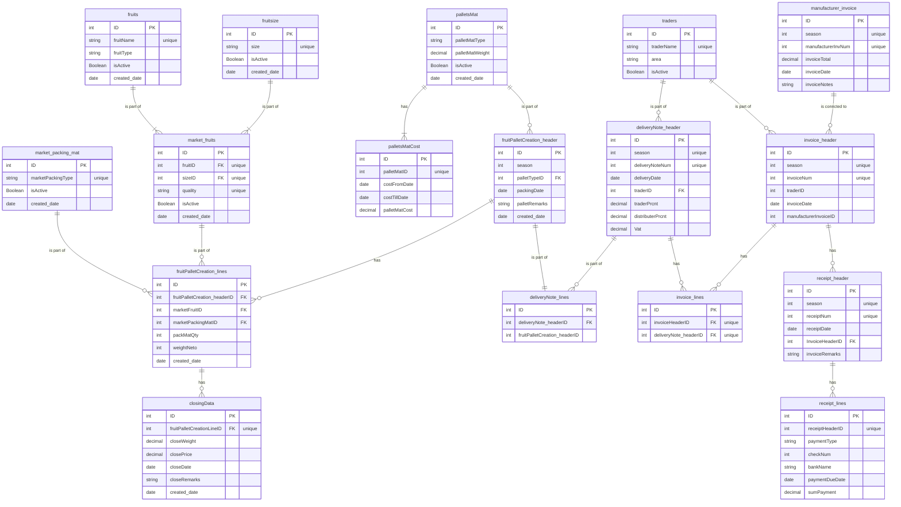

# “Aitan”Packing House's management tool
This project was developed to assist the packinghouse to be more efficient by capturing it entire activities.

# Technological tools:
 
 
# DataBase architecture:
Receiving Fruits section:

Local Market section:

# Server architecture – example:
 

# Client structure:
 * Components:
      * General comp – Popups, Generic components (table, updatesection , add, edit, table
      * Login –contain username & password (JWT)
      * Main page – contains how all the pages will be designed (main table and infrastructure, actions & reports)
      * Rec_fruit_comp / local market– for each DB table, we can do CRUD
      
 * Redux:
      * For each of the folders above we have the store data updates abilities:
      * Set action types, actions, reducer 
      * Root reducer – combines all the reducer
      * Set of store

 * UTLs:
      * Connections to API
